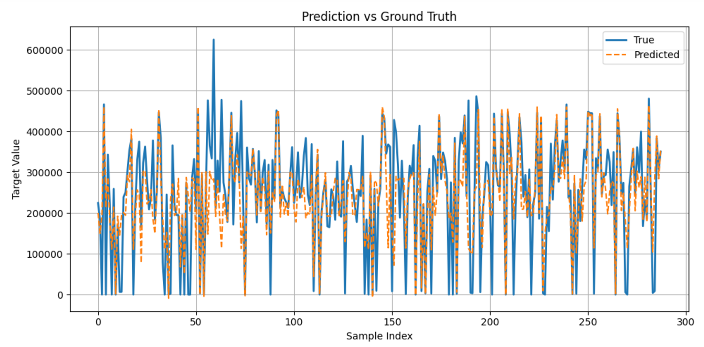

## 🚀 Forecast Energy Output
- This repository is to demostrate the models to forecast energy output using the provided sensor data.
- It predicts 1 day (24 hours) forward.
- For the processes of data engineering, model building, and training, refer to the notebooks.

### Prerequisites
 - Python 3.10,  
 - PyTorch 2.0.1
 - Polars 1.26.0
 - Numpy 1.24.4
 - CUDA, GPU Nvidia RTX-2080Ti
 - Ubuntu 22.04

### About models
 - This is a time series task, where I built Res-LSTM and TFT models; the TFT model performed better.
 - TFT Model: Refers to "Temporal Fusion Transformers"
 - Res-LSTM: Refers to "LSTM with residual connections"

### About experiments
- The original dataset was too time-consuming to process, so I created a smaller subset, approximately 1/10th of the original size.
  - You can chop the dataset with consecutive samples, or download it [here](https://drive.google.com/drive/folders/1kUelwTTDyimfI4EI_fk3_ilU_xQue-_s?usp=sharing).
- Data Processing:
  - Replaced null data with zeros or means.
  - Converted boolean data to numeric values (0 and 1).
  - Performed feature selection using feature-feature and feature-label correlation analysis.
- Training setup:
  - Loss function: MSE
  - OPtimizer: Adam
  - Learning rate scheduler: CosineAnnealing
  - Epoches:5000
- Predict 24 steps ahead, corresponding to 24 hours (5x12x24 samples).
- Due to hardware (GPU RAM) limitation, window size is set to 12 to 72, suggest to try 288, which represents a full 24-hour period.

### TODO
 - Data augmentation
   - Extract additional date-time features, such as hour, day of the week, and month.
 - Cross-Validation
 - Ensembling Approach, e.g., combine Res-LSTM and TFT models
 - Use Full Dataset
 - Set up window size to 288 (need GPU with larger RAM)